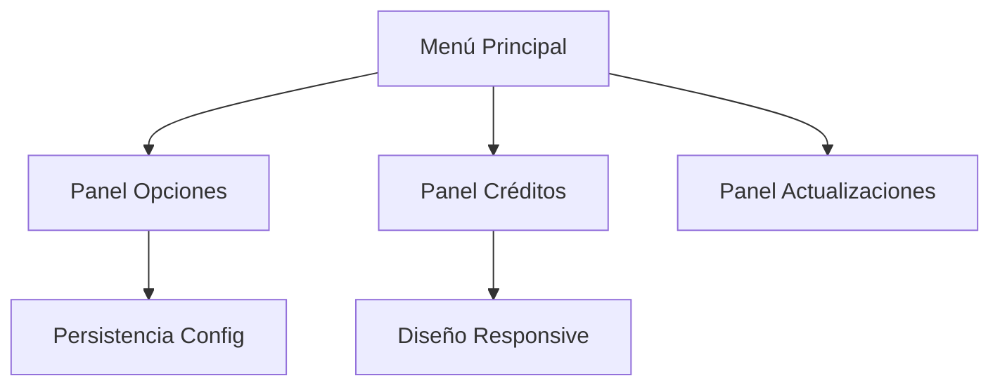

```markdown
# 🍳 Friday Night Cooking - Web Edition

**Menú interactivo para juego rítmico de cocina en HTML5/JS**  
✨ _Interfaz profesional con personalización completa_

## 🌟 Características implementadas
```javascript
const features = {
    menuSystem: {
        mainMenu: true,
        options: true,
        credits: true,
        updates: true
    },
    customization: {
        colorPicker: "Full HSL spectrum",
        themeSwitcher: ["light", "dark", "auto"]
    },
    technical: {
        animations: "CSS/JS smooth transitions",
        storage: "localStorage persistence",
        responsive: "Mobile-first design"
    }
};
```

## 🎨 Tecnologías utilizadas
| Área          | Stack                     |
|---------------|---------------------------|
| Frontend      | HTML5, CSS3, JavaScript   |
| UI Framework  | Bootstrap 5.3            |
| Animaciones   | CSS Transitions/Keyframes |
| Estado        | Vanilla JS State Management |

## 🚀 Demo en vivo
[]()  
*(Próximamente - Actualmente solo vista previa del menú)*

## 🔧 Cómo ejecutar
```bash
# Solo necesitas:
1. Clonar repositorio
2. Abrir index.html en navegador
3. ¡Personaliza los colores y disfruta!
```

## 📌 Proyecto actual


## 💡 Próximos pasos
- [ ] Integrar motor de juego rítmico
- [ ] Añadir sistema de perfiles
- [ ] Implementar API de canciones

📜 **Proyecto personal educativo** - ¡Aprendiendo desarrollo frontend avanzado!


